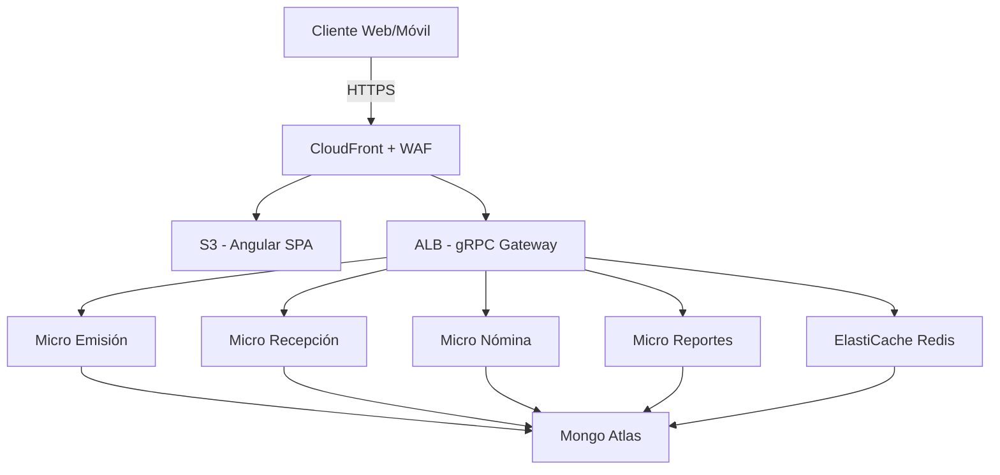
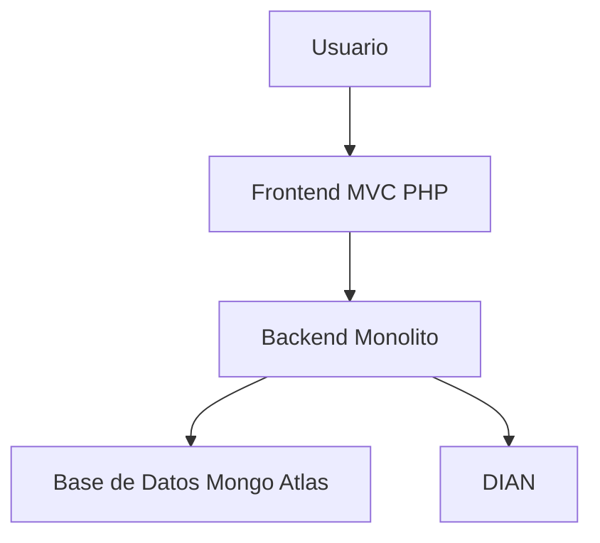
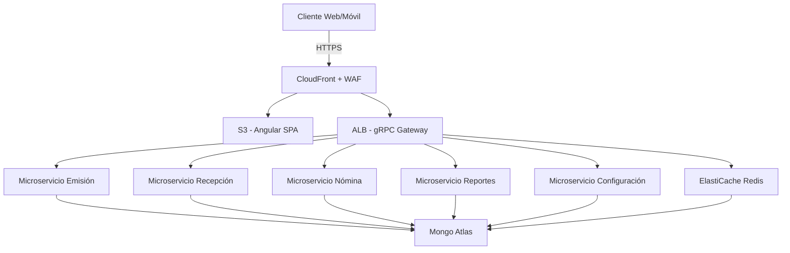
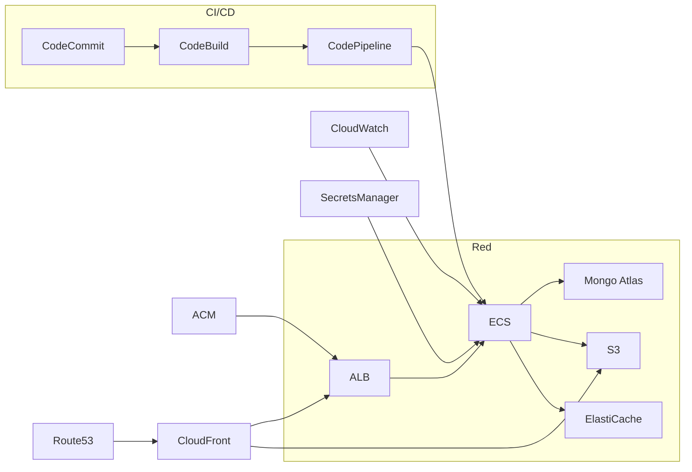

# 🧠 Análisis Técnico Profundo - Modernización Plataforma Esdinamico SAS

## Índice
- [1. Arquitectura Actual](#1-arquitectura-actual)
- [2. Estupendo 2.0 - Propuesta Técnica](#2-estupendo-20---propuesta-técnica)
- [3. Microservicios y APIs](#3-microservicios-y-apis)
- [4. Seguridad y Datos](#4-seguridad-y-datos)
- [5. Experiencia de Usuario (UX)](#5-experiencia-de-usuario-ux)
- [6. CI/CD y Observabilidad](#6-cicd-y-observabilidad)
- [7. Preguntas Clave al Equipo](#7-preguntas-clave-al-equipo)
- [8. Riesgos y Recomendaciones](#8-riesgos-y-recomendaciones)
- [9. Diagramas](#9-diagramas)

---

## 1. Arquitectura Actual

### Análisis
- Arquitectura PHP MVC monolítica con módulos: emisión, recepción, nómina.
- Múltiples funciones acopladas, alto riesgo de impacto por cambios.
- Integración con DIAN, gestión de usuarios, reportes, estadísticas.

### Preguntas
- ¿Qué herramientas de monitoreo se usan hoy?
- ¿Qué problemas de escalabilidad han sido más frecuentes?
- ¿Cuánto tiempo toma provisionar una nueva funcionalidad o cliente?

---

## 2. Estupendo 2.0 - Propuesta Técnica

### Análisis
- Arquitectura basada en microservicios (gRPC), frontend Angular separado.
- Infraestructura desplegada en AWS (ECS, S3, CloudFront, Mongo Atlas, etc.).
- Uso de servicios gestionados, mayor resiliencia, independencia de servicios.

### Preguntas
- ¿Cuáles serán los límites de contexto de cada microservicio?
- ¿Qué tipo de pruebas e2e se usarán en integración continua?
- ¿Cómo se controlarán cambios de contratos gRPC y documentación?

---

## 3. Microservicios y APIs

### Análisis
- Uso de Python/NodeJS y MongoDB.
- Separación en servicios: emisión, recepción, nómina, reportes, configuración.

### Preguntas
- ¿Cuál será el esquema de versionado de APIs?
- ¿Se usará Service Mesh (App Mesh, Istio)?
- ¿Cómo se gestionarán los errores entre microservicios?

---

## 4. Seguridad y Datos

### Análisis
- Uso de WAF, Secrets Manager, encriptación en tránsito y reposo.
- Mongo Atlas como base de datos principal.

### Preguntas
- ¿Cómo se gestionan los permisos granulares IAM entre microservicios?
- ¿Hay políticas de rotación de claves automatizadas?
- ¿Se utiliza cifrado de campo a nivel de aplicación?

---

## 5. Experiencia de Usuario (UX)

### Análisis
- Foco en Design Thinking, mockups Figma, UX personalizada por perfil.
- Frontend separado por subdominios.

### Preguntas
- ¿Hay validaciones de accesibilidad?
- ¿Se hará AB testing?
- ¿Qué métricas de UX serán monitoreadas?

---

## 6. CI/CD y Observabilidad

### Análisis
- Uso de GitHub Actions, CodePipeline, CloudWatch, Auto Scaling.

### Preguntas
- ¿Se usarán entornos efímeros por rama o pull request?
- ¿Quién aprueba despliegues a producción?
- ¿Cómo se realiza rollback ante error en producción?

---

## 7. Preguntas Clave al Equipo

| Área | Pregunta |
|------|----------|
| Arquitectura | ¿Cómo se sincronizan las entidades comunes entre servicios? |
| Infraestructura | ¿Qué RTO/RPO tiene la plataforma actual y futura? |
| QA | ¿Qué estrategia de pruebas multicliente y personalización se sigue? |
| UX/UI | ¿Cómo se validan las decisiones de diseño con usuarios reales? |
| Soporte | ¿Cómo escalan tickets relacionados con errores de emisión? |

---

## 8. Riesgos y Recomendaciones

| Riesgo | Recomendación |
|--------|---------------|
| Acoplamiento entre servicios | Implementar colas SQS para desacoplar eventos |
| Falta de observabilidad | Adoptar OpenTelemetry y centralizar métricas |
| Problemas de despliegue | Pipeline con validaciones por etapa y rollback |
| Seguridad de datos | Cifrado por campo y rotación automática en Secrets Manager |

---

## 9. Diagramas

### Arquitectura Propuesta (Mermaid)

---
# 📘 Anexo Técnico - Análisis Modernización Plataforma Esdinamico SAS

## Índice

- [1. Resumen Ejecutivo](#1-resumen-ejecutivo)
- [2. Preguntas Clave por Sección](#2-preguntas-clave-por-sección)
- [3. Riesgos y Omisiones Detectadas](#3-riesgos-y-omisiones-detectadas)
- [4. Diagramas de Arquitectura](#4-diagramas-de-arquitectura)
- [5. Matriz de Microservicios](#5-matriz-de-microservicios)
- [6. Recursos AWS Involucrados](#6-recursos-aws-involucrados)

---

## 1. Resumen Ejecutivo

La plataforma de Esdinamico SAS está en proceso de evolución de un sistema monolítico MVC en PHP hacia una arquitectura basada en microservicios sobre AWS. Esta transformación incluye:

- Separación de frontend (Angular) y backend (Node.js/Python con gRPC).
- Uso intensivo de servicios AWS: EC2, ECS, S3, CloudFront, Mongo Atlas, entre otros.
- Integración robusta con la DIAN y notificaciones por correo electrónico.
- Orientación UX mediante Design Thinking y mockups en Figma.

---

## 2. Preguntas Clave por Sección

### Arquitectura Actual
- ¿Qué tecnologías específicas (frameworks, versiones) se usan actualmente?
- ¿Cómo se maneja la disponibilidad y el balanceo de carga?

### Microservicios y gRPC
- ¿Qué patrón de comunicación asincrónica se usará (SQS, EventBridge)?
- ¿Qué estrategia de migración se seguirá: big bang, por dominio, híbrida?

### Seguridad
- ¿Se ha considerado el uso de AWS Cognito para autenticación?
- ¿Cómo se gestionará el versionamiento de APIs y su documentación?

### Frontend Angular
- ¿Se usan herramientas como Storybook o tests e2e para validación del diseño?
- ¿Los buckets de S3 estarán en la misma región que la VPC backend?

---

## 3. Riesgos y Omisiones Detectadas

| Área | Riesgo u Omisión |
|------|------------------|
| CI/CD | No hay mención a entornos separados o revisión de código en el pipeline. |
| Testing | No se describen suites de pruebas ni validación de integración. |
| Costo | No se evalúa impacto económico por uso de recursos AWS escalables. |
| Monitoreo | No hay mención de herramientas como Datadog, OpenTelemetry o X-Ray. |

---

## 4. Diagramas de Arquitectura

### Diagrama Actual (Simplificado)

---

### Diagrama Propuesta - Estupendo 2.0

---

## 5. Matriz de Microservicios

| Microservicio | Lenguaje | Función | Comunicación | Dependencias |
|---------------|----------|---------|--------------|--------------|
| Emisión | Node.js | Crear y enviar facturas | gRPC | MongoDB, Email |
| Recepción | Python | Recibir y validar documentos | gRPC | MongoDB |
| Nómina | Node.js | Generar pagos de empleados | gRPC | MongoDB |
| Configuración | Python | Parametrización del sistema | gRPC | Secrets Manager |
| Reportes | Node.js | Generación de dashboards | REST/gRPC | MongoDB |

---

## 6. Recursos AWS Involucrados

---

